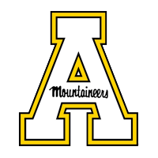

Alexander Boudreau
=

#### Undergraduate at Appalachian State University
Email: alexboudreau19@gmail.com

Education
=
#### Bachelor of Science in Community & Regional Planning and Geography Double Major                     *Fall 2022*
- Understanding of fundamental remote sensing concepts and utilizing remotely sensed data
for environmental information extraction and problem solving.
- Gained competence in the use of Geographic Information System (GIS) digital software to combine maps and datasets about environmental events and socioeconomic trends.
- Gained insight into the technical and political process that is focused on the development and
design of land use and the built environment.
- ArcMap, ArcGIS Pro, ENVI, QGIS, ArcGIS Online, Adobe Illustrator.

Work Experience
=
Eagle Scout of [Boy Scout Troop 101](https://gsotroop-101.trooptrack.com/share/pages/16601)
- Patrol Leader, Assistant Patrol Leader, Quartermaster, Den Chief, Order of the Arrow Representative

Starmount Forest Country Club, Greensboro, NC *Summer 2017-Summer 2020*
- Server and Special Event Staff

Mellow Mushroom, Boone, NC *Summer 2021-Fall 2021*
- Back of house Staff, Line Cook, Dishwasher
